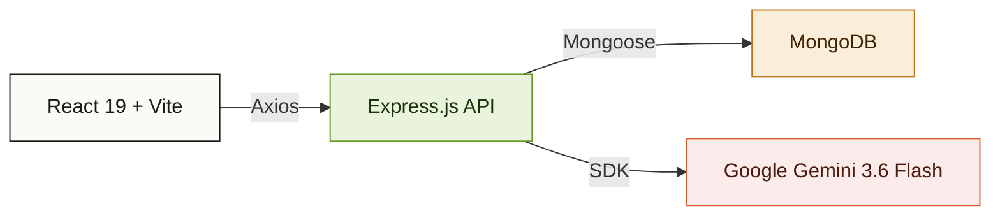
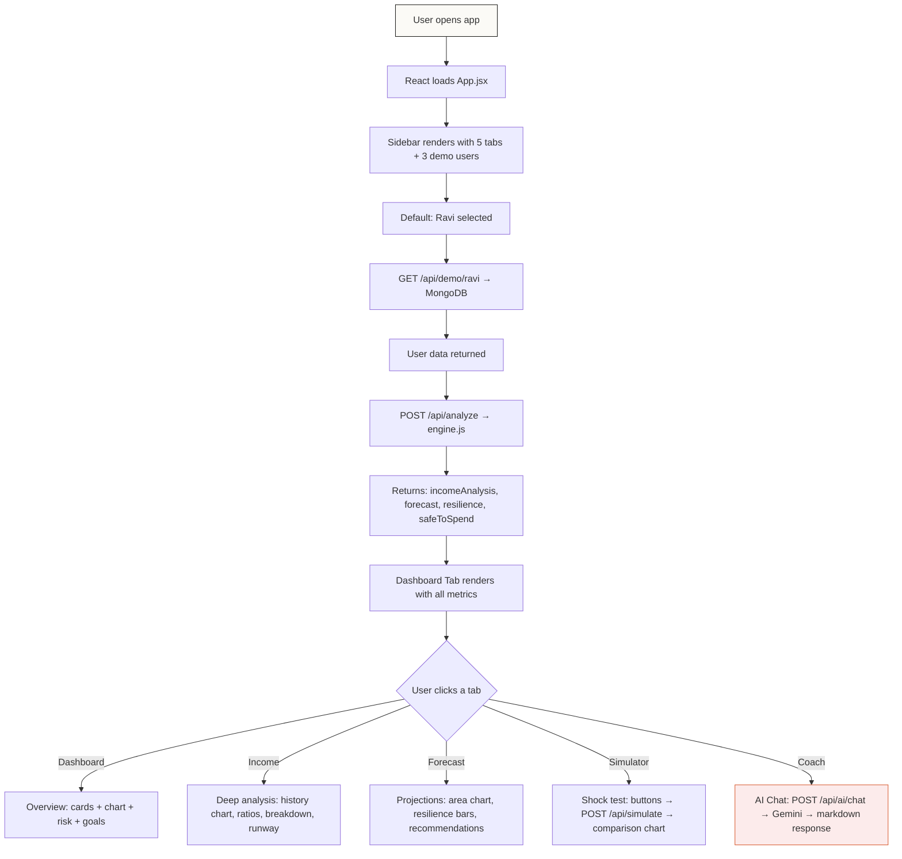

# Krypton — Project Overview

## What is Krypton?

**Krypton** is an AI-powered **financial resilience platform** designed for people with **irregular incomes** — gig workers, freelancers, auto drivers, delivery partners — who don't have predictable monthly paychecks. Unlike traditional budgeting apps that assume a fixed salary, Krypton analyzes volatile income patterns and provides smart, data-driven guidance to help users survive financial shocks.

---

## The Problem It Solves

> *"Can I afford to buy this phone?"*  
> *"What happens if my income drops 30% next month?"*  
> *"How long will my savings last?"*

Most financial tools just check your bank balance. Krypton goes deeper — it considers income volatility, debt obligations, essential expenses, savings runway, and future projections before answering.

---

## Tech Stack



| Layer | Technology | Purpose |
|-------|-----------|---------|
| **Frontend** | React 19 + Vite | Ultra-fast SPA with HMR |
| **Charts** | Recharts (Line, Bar, Area) | Data visualization |
| **Markdown** | react-markdown | Renders AI responses |
| **HTTP Client** | Axios | API communication |
| **Styling** | Vanilla CSS + Inline JS | Warm, light-themed design system |
| **Backend** | Node.js + Express 5 | REST API server |
| **Database** | MongoDB (via Mongoose) | User data persistence |
| **Dev DB** | mongodb-memory-server | Zero-config in-memory MongoDB for local dev |
| **AI Engine** | Google Gemini 3.6 Flash | Conversational financial assistant |
| **Env Mgmt** | dotenv | Secure API key handling |
| **Security** | CORS middleware | Cross-origin request handling |

---

## Project Structure

```
krypton/
├── client/                          # Frontend (React + Vite)
│   ├── src/
│   │   ├── App.jsx                  # Main app — sidebar, 5 dashboard tabs
│   │   ├── App.css                  # Global styles
│   │   ├── api.js                   # Axios API helper methods
│   │   └── main.jsx                 # React entry point
│   ├── index.html
│   └── package.json
│
├── server/                          # Backend (Express + MongoDB)
│   ├── models/
│   │   └── User.js                  # Mongoose schema for user documents
│   ├── controllers/
│   │   ├── userController.js        # GET /api/demo/:userId
│   │   ├── financeController.js     # POST /api/analyze, /api/simulate
│   │   └── aiController.js          # POST /api/ai/advice, /api/ai/chat
│   ├── routes/
│   │   └── apiRoutes.js             # All API route definitions
│   ├── engine.js                    # Core financial calculation engine
│   ├── gemini.js                    # Gemini AI integration (chat + advice)
│   ├── db.js                        # MongoDB connection + auto-seeding
│   ├── demoData.json                # Seed data for 3 demo users
│   ├── server.js                    # Express app entry point
│   ├── .env                         # GEMINI_API_KEY (secret)
│   └── package.json
```

---

## Application Flow



---

## The 5 Dashboard Tabs

### 1. 📊 Dashboard (Overview)
- **4 metric cards**: Savings, Resilience Score, Safe-to-Spend, Emergency Cover
- **Monthly Snapshot**: Average income, obligations, surplus, savings rate
- **Income Trend**: Mini line chart with growth % indicator
- **Risk Summary**: Top 3 risk factors with progress bars
- **Top Recommendations**: Priority-tagged action items
- **Financial Goal**: Displays user's current goal (emergency fund / investment / debt repayment)

### 2. 💰 Income (Deep Analysis)
- **4 stat cards**: Average, Median, Volatility %, Growth %
- **Full Income History Chart**: Line chart with obligation + average reference lines
- **Income Range**: Min/Max/Spread with standard deviation
- **Money Flow Breakdown**: Horizontal bar chart (income vs essentials vs debt vs surplus)
- **Monthly Income Log**: Color-coded grid (green = above avg, red = below)
- **Key Ratios**: Debt-to-income, Expense-to-income, Savings rate with visual bars
- **Runway Analysis**: Big number display showing months of coverage + health status

### 3. 🔮 Forecast (Future Projections)
- **4 forecast cards**: Pessimistic, Expected, Optimistic, Range
- **Area Chart**: 3-month income projection with forecast bands (low/expected/high) + obligations line
- **Resilience Breakdown**: Big score display + horizontal bar chart of all 5 resilience factors
- **Risk Factor Analysis**: What's dragging the score down
- **Scenario Outlook**: Contextual text analysis (✅/⚠️/🚨)
- **Smart Recommendations**: Full list of priority-tagged actions

### 4. ⚡ Simulator (Income Shock Testing)
- **3 baseline cards**: Expected income, Obligations, Runway
- **5 shock buttons**: -10%, -20%, -30%, -50%, -75%
- **4 impact cards**: Projected income, Surplus/Deficit, Savings coverage, Risk level
- **Before vs After Bar Chart**: Visual comparison of current vs shocked income vs obligations
- **Impact Analysis**: Color-coded paragraph explaining what happens in plain language

### 5. 🧠 Coach (AI Financial Assistant)
- **3 context cards**: Safe-to-spend, Resilience, Volatility
- **Quick Question Buttons**: Pre-filled prompts like *"Can I afford a ₹20,000 phone?"*
- **Full Chat Interface**: Conversational AI powered by Gemini, with markdown rendering
- **Financial Context Injection**: Every message includes user's income, savings, debts, volatility, and resilience score

---

## Backend Engine (engine.js)

The financial calculation engine has 5 core functions:

| Function | What It Does |
|----------|-------------|
| `analyzeIncome()` | Computes average, median, min, max, std dev, volatility, and period count from income history |
| `forecastIncome()` | Projects future income using median ± standard deviation (low/expected/high) |
| `calculateResilience()` | Scores financial health 0-100 using weighted factors: income stability (30%), savings buffer (25%), debt capacity (20%), expense flexibility (15%), income trend (10%) |
| `calculateSafeToSpend()` | Determines how much the user can safely spend after accounting for obligations and emergency reserve |
| `simulateIncomeShock()` | Models what happens if income drops by X% — calculates new surplus/deficit, savings runway, and risk level |

---

## AI Integration (gemini.js)

Two modes of AI interaction:

1. **`getFinancialAdvice()`** — One-shot JSON advice (summary, risk, recommendations, buffer advice)
2. **`chatWithAssistant()`** — Conversational chat using `model.startChat()` with full financial context injected into the system prompt

The AI is instructed to:
- Consider the user's **overall financial condition**, not just current balance
- Explain reasoning behind every recommendation
- Highlight risks (upcoming bills, low savings, high expenses, unstable income)
- Give clear Yes/No/Yes-but guidance before explaining

---

## API Endpoints

| Method | Endpoint | Controller | Description |
|--------|----------|-----------|-------------|
| `GET` | `/api/health` | inline | Health check |
| `GET` | `/api/demo/:userId` | `userController` | Fetch user from MongoDB |
| `POST` | `/api/analyze` | `financeController` | Run full financial analysis |
| `POST` | `/api/simulate` | `financeController` | Simulate income shock |
| `POST` | `/api/ai/advice` | `aiController` | Get one-shot AI advice |
| `POST` | `/api/ai/chat` | `aiController` | Conversational AI chat |

---

## Demo Users

| User | Occupation | Income Type | Avg Income | Savings | Goal |
|------|-----------|-------------|------------|---------|------|
| **Ravi** | Delivery Partner | Irregular | ~₹24.7K | ₹30,000 | Emergency Fund |
| **Priya** | Freelance Designer | Irregular | ~₹26.5K | ₹60,000 | Investment |
| **Arjun** | Auto Rickshaw Driver | Irregular | ~₹17.3K | ₹8,000 | Debt Repayment |

---

## How to Run

```bash
# Terminal 1 — Backend
cd server
npm install
npm start          # Starts Express on :5001, auto-connects MongoDB, seeds data

# Terminal 2 — Frontend
cd client
npm install
npm run dev        # Starts Vite dev server on :5173
```

> **Note:** Add your Gemini API key to `server/.env` as `GEMINI_API_KEY=your_key_here`
